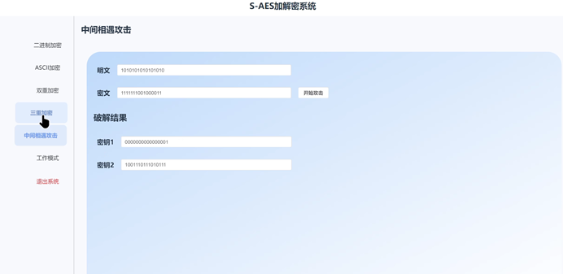

# S-AES过关测试

## 第1关：基本测试

根据S-AES算法编写和调试程序，提供GUI解密支持用户交互。输入可以是16bit的数据和16bit的密钥，输出是16bit的密文。

加密：

解密：

 

## 第2关：交叉测试

考虑到是"**算法标准"**，所有人在编写程序的时候需要使用相同算法流程和转换单元(替换盒、列混淆矩阵等)，以保证算法和程序在异构的系统或平台上都可以正常运行。

设有A和B两组位同学(选择相同的密钥K)；则A、B组同学编写的程序对明文P进行加密得到相同的密文C；或者B组同学接收到A组程序加密的密文C，使用B组程序进行解密可得到与A相同的P。

胡海波老师教学班陈露，罗丹小组的加密、解密结果：

我们的加解密结果：

可以看出，两个小组对同一个明/密文和密钥的加/解密结果一致，因此通过了交叉测试

## 第3关：扩展功能

考虑到向实用性扩展，加密算法的数据输入可以是ASII编码字符串(分组为2 Bytes)，对应地输出也可以是ACII字符串(很可能是乱码)。

加密：

解密：

## 第4关：多重加密

3.4.1 双重加密

将S-AES算法通过双重加密进行扩展，分组长度仍然是16 bits，但密钥长度为32 bits。

加密：

解密：

3.4.2 中间相遇攻击

假设你找到了使用相同密钥的明、密文对(一个或多个)，请尝试使用中间相遇攻击的方法找到正确的密钥Key(K1+K2)。

攻击结果：

3.4.3 三重加密

将S-AES算法通过三重加密进行扩展。

加密：

解密：

## 第5关：工作模式

基于S-AES算法，使用密码分组链(CBC)模式对较长的明文消息进行加密。注意初始向量(16 bits) 的生成，并需要加解密双方共享。

在CBC模式下进行加密，并尝试对密文分组进行替换或修改，然后进行解密，请对比篡改密文前后的解密结果。

# 用户手册

## 一、引言

1. 文档目的：本用户指南旨在帮助用户了解和使用基于 Flask、HTML、Vue 开发的 S_AES 加密算法应用程序，包括二进制加密，ascll加密，双重加密，三重加密，中间相遇攻击，工作模式几个模块。
2. 适用范围：适用于需要对数据进行加密和解密操作的用户直接使用本程序进行加解密操作，以及对密码学和网络安全感兴趣的技术爱好者提供一定的专业参考。

## 二、产品概述

### 1、功能简介：

- 二进制加密：用户输入的明文,并获取随机的密钥，通过 S_AES 加密算法进行加密，生成密文。另外可以输入密文和密钥反向获取明文。
- ascll加密：用户输入的ascll明文,并获取随机的密钥，通过 S_AES 加密算法进行加密，生成密文。另外可以输入密文和密钥反向获取明文。
- 双重加密：与二进制加密类似，但每次使用两把密钥进行加解密。
- 三重加密：与二进制加密类似，但每次使用三把密钥进行加解密。
- 中间相遇攻击：输入明文和密文，破解出双重加密的两把密钥。
- 工作模式：使用密码分组链(CBC)模式对较长的明文消息进行加密，输入明文和密钥，获得初始向量后加密得到结果。解密时输入密文，密钥和初始向量获得明文。

### 2、系统要求：

浏览器：支持现代浏览器，如 Chrome、Firefox、Safari 等。

### 3、安装与配置：

无需安装，用户只需通过浏览器访问应用程序的网址即可使用。

## 三、使用说明

### 1、界面介绍：

二进制加密：包含明文输入框、密钥获取按钮以及显示密钥区域，加密按钮和加密结果显示区域。密文输入框、密钥输入框，解密按钮和解密结果显示区域。

ascll加密：包含明文输入框、密钥获取按钮以及显示密钥区域，加密按钮和加密结果显示区域。密文输入框、密钥输入框，解密按钮和解密结果显示区域。

双重加密页面：包含明文输入框、两把密钥输入框，加密按钮和加密结果显示区域。密文输入框、两把密钥输入框，解密按钮和解密结果显示区域。

三重加密页面：包含明文输入框、三把密钥输入框，加密按钮和加密结果显示区域。密文输入框、三把密钥输入框，解密按钮和解密结果显示区域。

中间相遇攻击页面：包含明文输入框和密文输入框，两把密钥破解结果。

工作模式页面：包含明文输入框、密钥输入框，初始随机向量获取，加密按钮和加密结果显示区域。密文输入框、密钥输入框，初始随机向量输入框，解密按钮和解密结果显示区域。

### 2、操作流程：

二进制加密：

- a)  在加密页面的明文输入框中输入要加密的文本。
- b)  点击“获取随机密钥”获得加密密钥。
- c)  点击“开始加密”按钮，系统将使用 S-AES 加密算法对明文进行加密，并在加密结果显示区域显示密文。
- d)  在解密页面的密文输入框中输入要解密的密文。
- e)  在密钥输入框中输入正确的密钥。
- f)  点击解密按钮，系统将使用解密算法对密文进行解密，并在解密结果显示区域显示明文。

ascll加密：

- a)  在加密页面的明文输入框中输入要加密的文本。
- b)  点击“获取随机密钥”获得加密密钥。
- c)  点击“开始加密”按钮，系统将使用 S-AES 加密算法对明文进行加密，并在加密结果显示区域显示密文。
- d)  在解密页面的密文输入框中输入要解密的密文。
- e)  在密钥输入框中输入正确的密钥。
- f)  点击解密按钮，系统将使用解密算法对密文进行解密，并在解密结果显示区域显示明文。

双重加密：

- a)  在加密页面的明文输入框中输入要加密的文本。
- b)  输入两把随机获得的密钥。
- c)  点击“开始加密”按钮，系统将使用 S-AES 加密算法对明文进行加密，并在加密结果显示区域显示密文。
- d)  在解密页面的密文输入框中输入要解密的密文。
- e)  在密钥输入框中输入加密时使用 两把密钥。
- f)  点击解密按钮，系统将使用解密算法对密文进行解密，并在解密结果显示区域显示明文。

三重加密：

- a)  在加密页面的明文输入框中输入要加密的文本。
- b)  输入三把随机获得的密钥。
- c)  点击“开始加密”按钮，系统将使用 S-AES 加密算法对明文进行加密，并在加密结果显示区域显示密文。
- d)  在解密页面的密文输入框中输入要解密的密文。
- e)  在密钥输入框中输入正确的三把密钥。
- f)  点击解密按钮，系统将使用解密算法对密文进行解密，并在解密结果显示区域显示明文。

中间相遇攻击：

- a)  在明文输入框输入明文
- b)  在密文输入框输入密文
- c)  点击开始攻击，将获得两把密钥

工作模式：

- a)  在加密页面的明文输入框中输入要加密的文本。
- b)  输入随机获得的密钥。
- c)  点击获得随机初始向量获得初始向量
- d)  点击“开始加密”按钮，对明文进行加密，并在加密结果显示区域显示密文。
- e)  在解密页面的密文输入框中输入要解密的密文。
- f)  在密钥输入框中输入正确的密钥。
- g)  输入加密时的初始向量点击解密按钮，系统将使用解密算法对密文进行解密，并在解密结果显示区

## 四、维护与更新

本应用程序由开发者进行维护和更新，后续可能会增加新功能，用户可以访问作者github账号，以获取最新版本。

## 五、附录

### 1、术语表：

- l S_AES 加密算法：一种加密算法，在该应用程序中用于对数据进行加密和解密操作。
- l 二进制加密：应用程序中的一个模块，对用户输入的明文通过 S_AES 加密算法进行加密，生成密文，可反向解密，密钥随机生成。
- l ascll 加密：应用程序中的一个模块，对用户输入的 ascll 明文进行加密，生成密文，可反向解密，密钥随机生成。
- l 双重加密：类似二进制加密，但使用两把密钥进行加解密。
- l 三重加密：类似二进制加密，但使用三把密钥进行加解密。
- l 中间相遇攻击：应用程序中的一个功能，输入明文和密文，破解出双重加密的两把密钥。
- l 工作模式：应用程序中的一个模块，使用密码分组链（CBC）模式对较长的明文消息进行加密和解密，需要输入明文、密钥和初始向量。
- l 明文：未加密的原始文本。
- l 密文：经过加密后的文本。
- l 密钥：用于加密和解密的关键信息。
- l 初始向量：在密码分组链（CBC）模式中用于初始化加密过程的随机值。

### 2、参考资料：

- l 《信息安全导论》
- l Flask 官方文档
- l Vue 官方文档

# 开发手册

## 一、引言

1. 文档目的：本开发手册旨在为开发人员提供基于 Flask、HTML、Vue 开发的 S     - AES 加密算法应用程序的接口说明，以便他们在开发过程中正确使用这些接口。
2. 适用范围：适用于需要对 S - AES 加密算法进行集成或二次开发的开发人员。

## 二、系统概述

### 1、架构说明

**SAES** **模块**

主要由一系列函数组成，实现了 S - AES 加密算法的各个步骤，包括置换、左移、S 盒替换、生成子密钥、加密、解密以及一些辅助函数。函数之间通过调用关系相互协作，共同完成加密、解密和攻击等功能。
 使用 Python 的内置函数和列表操作实现各种置换和转换操作。利用 random 模块生成随机密钥。通过位操作和异或运算实现加密和解密过程中的关键步骤。

**flaskBack** **模块**

该 Flask 应用使用了 flask_cors 扩展来处理跨域请求。定义了多个路由，分别对应二进制加密、二进制解密、ASCII 加密、ASCII 解密、双重加密、双重解密、三重加密、三重解密、中间相遇攻击、工作模式加密、工作模式解密以及生成随机二进制密钥和随机 ASCII 密钥功能。每个路由通过调用 SAES 模块中的相应函数来实现具体的功能。
 使用 Flask 的路由装饰器来定义不同的接口路径和请求方法。通过 request.json 获取 POST 请求中的 JSON 数据。使用 jsonify 函数返回 JSON 格式的响应。

**前端模块**

基于Element UI组件构建页面，分为左右两部分。左边是功能卡片导航，右边是功能区域，根据所选卡片显示对应功能的输入和结果区域。

使用Vue的响应式数据和模板语法，通过`v-model`双向绑定输入框数据，如不同加密模块中的明文、密钥等。

引入`axios`与后端Flask接口异步通信，按钮点击事件触发相应操作，如加密、解密、获取密钥等，将数据发送到后端并更新结果显示区域。

利用Element UI组件进行界面构建和美化，设置不同类名控制样式，如`leftCardStyle`、`rightTitle`等，同时设置`shadow="never"`等属性调整外观。

### 2、技术选择

**Flask**

Flask 是一个轻量级的 Web 框架，对于小型到中型规模的应用非常适合。对于这个 S - AES 加密算法应用程序，不需要过于复杂庞大的框架，Flask 可以快速搭建起后端服务。允许开发者根据具体需求进行高度定制化开发。可以轻松地集成加密算法相关的功能模块，并且方便进行扩展和修改。

**HTML**

HTML 是网页开发的基础语言，几乎所有的浏览器都支持 HTML，具有广泛的通用性。可以清晰地定义网页的结构和内容布局，方便用户直观地理解和操作应用程序。

**Vue**

Vue 的组件化开发模式可以提高代码的可维护性和可复用性。对于复杂的前端界面，可以将不同的功能模块拆分成独立的组件，方便开发和管理。可以实现数据的双向绑定，使得页面的数据更新更加自动和高效。开发者只需关注数据的变化，而无需手动操作 DOM 来更新页面。可以根据项目的需求逐步引入 Vue 的功能，对于不同规模的项目都有较好的适应性。

### 3、加密算法概述

S-AES（简化的高级加密标准）是一种简化版的AES算法，主要用于教学和学习目的。其主要特点包括：

- a)  简化的结构：S-AES使用8位的明文和密文块，以及16位的密钥，相比AES的128位块和密钥更易于理解和实现。
- b)  易于学习：S-AES的加密和解密过程包含几个清晰的步骤，如字节代换（SubBytes）、行移位（ShiftRows）、列混淆（MixColumns）和轮密钥加（Add Round Key），这使得初学者能够轻松掌握AES的核心概念。
- c)  核心功能保留：虽然结构简化，S-AES依然保留了AES的关键操作，包括非线性变换、数据扩散和密钥混合，确保其在安全性和复杂性上的教学价值。
- d)  适用场景：S-AES特别适合嵌入式系统和加密算法的实验与测试，使其成为教育工具和小型应用的理想选择。

## 三、接口列表

### SAES 模块

1. generate_random_bin_key(bits = 16)

   - 功能：生成一个 16 位的随机二进制密钥。
   - 返回值：一个 16 位的由 0 和 1 组成的字符串，表示生成的密钥。

2. generate_random_ascii_key(bits = 16)

   - 功能：生成一个 16 位的随机 ASCII 密钥。
   - 返回值：一个由 ASCII 字符组成的字符串，表示生成的密钥。

3. encrypt(plaintext, key)

   - 功能：使用给定的密钥对明文进行加密。

   - 参数：

     - plaintext：要加密的明文字符串（16 位二进制字符串）。

     - key：加密密钥（16 位二进制字符串）。

   - 返回值：加密后的密文的二进制字符串。

4. decrypt(ciphertext, key)

   - 功能：使用给定的密钥对密文进行解密。

   - 参数：

     - ciphertext：要解密的密文的二进制字符串（16 位）。

     - key：解密密钥（16 位二进制字符串）。

   - 返回值：解密后的明文字符串（16 位二进制字符串）。

### flaskBack 模块

1. /binEncryption
   - 请求方法：POST
   - 功能：对给定的二进制明文进行加密。
2. /binDecryption
   - 请求方法：POST
   - 功能：对给定的二进制密文进行解密。
3. /asciiEncryption
   - 请求方法：POST
   - 功能：对给定的 ASCII 明文进行加密。
4. /asciiDecryption
   - 请求方法：POST
   - 功能：对给定的 ASCII 密文进行解密。
5. /doubleEncryption
   - 请求方法：POST
   - 功能：对给定的明文进行双重加密。
6. /doubleDecryption
   - 请求方法：POST
   - 功能：对给定的密文进行双重解密。
7. /tripleEncryption
   - 请求方法：POST
   - 功能：对给定的明文进行三重加密。
8. /tripleDecryption
   - 请求方法：POST
   - 功能：对给定的密文进行三重解密。
9. /attack
   - 请求方法：POST
   - 功能：进行中间相遇攻击，尝试找出加密所用的密钥。
10. /workEncryption
    - 请求方法：POST
    - 功能：对给定的明文进行工作模式（CBC 模式）加密。
11. /workDecryption
    - 请求方法：POST
    - 功能：对给定的密文进行工作模式（CBC 模式）解密。
12. /getBinKey
    - 请求方法：POST
    - 功能：生成一个随机的二进制密钥。
13. /getKey
    - 请求方法：POST
    - 功能：生成一个随机的 ASCII 密钥。

## 四、接口详细说明

### SAES 模块

1. generate_random_bin_key(bits = 16)

- 内部实现：使用`random.choice(['0', '1'])`循环 16 次生成一个 16 位的随机二进制字符串。

- 调用示例：`key = generate_random_bin_key()`

2. generate_random_ascii_key(bits = 16)

   - 内部实现：先将 16 位转换为 2 字节（`n = bits // 8`），然后使用`random.randint(32, 126)`生成每个字节对应的 ASCII 字符，最后拼接成字符串。

   - 调用示例：`key = generate_random_ascii_key()`

3. encrypt(plaintext, key)

   - 内部实现：

     - 首先检查`plaintext`和`key`是否为 16 位二进制字符串，如果不是则抛出`ValueError`异常。

     - 将`plaintext`转换为初始状态，经过多轮加密操作，包括添加轮密钥（`add_round_key`）、字节替换（`substitute_nibbles`）、行移位（`shift_rows`）、列混合（`mix_columns`）等操作。

   - 调用示例：`ciphertext = encrypt("16 位二进制明文", "16 位二进制密钥")`

4. decrypt(ciphertext, key)

   - 内部实现：

     - 首先检查`ciphertext`和`key`是否为 16 位二进制字符串，如果不是则抛出`ValueError`异常。

     - 将`ciphertext`转换为初始状态，经过多轮解密操作，包括添加轮密钥（`add_round_key`）、逆字节替换（`inverse_substitute_nibbles`）、逆行移位（`inverse_shift_rows`）、逆列混合（`inverse_mix_columns`）等操作。

   - 调用示例：`plaintext = decrypt("16 位二进制密文", "16 位二进制密钥")`

### flaskBack 模块

1. /binEncryption

  \- 请求参数：

​    \- `binEnPlainText`：要加密的二进制明文字符串。

​    \- `binEnSecretKey`：加密密钥，16 位二进制字符串。

  \- 响应格式：

​    \- 成功：`{"binEnCipherText": "加密后的密文"}`

​    \- 错误：`{"error": "错误信息"}`，状态码为 400 或 500

2. /binDecryption

  \- 请求参数：

​    \- `binDeCipherText`：要解密的二进制密文的字符串。

​    \- `binDeSecretKey`：解密密钥，16 位二进制字符串。

  \- 响应格式：

​    \- 成功：`{"binDePlainText": "解密后的明文字符串"}`

​    \- 错误：`{"error": "错误信息"}`，状态码为 400 或 500

3. /asciiEncryption

  \- 请求参数：

​    \- `asciiEnPlainText`：要加密的 ASCII 明文字符串。

​    \- `asciiEnSecretKey`：加密密钥，需先将 16 位二进制字符串转换为 ASCII 对应二进制（`binary_key = ''.join([format(ord(c), '08b') for c in asciiEnSecretKey])`）。

  \- 响应格式：

​    \- 成功：`{"asciiEnCipherText": "加密后的 ASCII 密文（可能是乱码）"}`

​    \- 错误：`{"error": "错误信息"}`，状态码为 400 或 500

4. /asciiDecryption

  \- 请求参数：

​    \- `asciiDeCipherText`：要解密的 ASCII 密文的字符串。

​    \- `asciiDeSecretKey`：解密密钥，需先将 16 位二进制字符串转换为 ASCII 对应二进制。

  \- 响应格式：

​    \- 成功：`{"asciiDePlainText": "解密后的 ASCII 明文字符串"}`

​    \- 错误：`{"error": "错误信息"}`，状态码为 400 或 500

5. /doubleEncryption

  \- 请求参数：

​    \- `doubleEnPlainText`：要加密的明文字符串。

​    \- `doubleEnSecretKey1`：第一轮加密密钥，16 位二进制字符串。

​    \- `doubleEnSecretKey2`：第二轮加密密钥，16 位二进制字符串。

  \- 响应格式：

​    \- 成功：`{"doubleEnCipherText": "双重加密后的密文"}`

​    \- 错误：`{"error": "错误信息"}`，状态码为 400 或 500

6. /doubleDecryption

  \- 请求参数：

​    \- `doubleDeCipherText`：要解密的密文的字符串。

​    \- `doubleDeSecretKey1`：第一轮解密密钥，16 位二进制字符串。

​    \- `doubleDeSecretKey2`：第二轮解密密钥，16 位二进制字符串。

  \- 响应格式：

​    \- 成功：`{"doubleDePlainText": "双重解密后的明文字符种"}`

​    \- 错误：`{"error": "错误信息"}`，状态码为 400 或 500

7. /tripleEncryption

  \- 请求参数：

​    \- `tripleEnPlainText`：要加密的明文字符串。

​    \- `tripleEnSecretKey1`：第一轮加密密钥，16 位二进制字符串。

​    \- `tripleEnSecretKey2`：第二轮加密密钥，16 位二进制字符串。

​    \- `tripleEnSecretKey3`：第三轮加密密钥，16 位二进制字符串。

  \- 响应格式：

​    \- 成功：`{"tripleEnCipherText": "三重加密后的密文"}`

​    \- 错误：`{"error": "错误信息"}`，状态码为 400 或 500

8. /tripleDecryption

  \- 请求参数：

​    \- `tripleDeCipherText`：要解密的密文的字符串。

​    \- `tripleDeSecretKey1`：第一轮解密密钥，16 位二进制字符串。

​    \- `tripleDeSecretKey2`：第二轮解密密钥，16 位二进制字符串。

​    \- `tripleDeSecretKey3`：第三轮解密密钥，16 位二进制字符串。

  \- 响应格式：

​    \- 成功：`{"tripleDePlainText": "三重解密后的明文字符串"}`

​    \- 错误：`{"error": "错误信息"}`，状态码为 400 或 500

9. /attack

  \- 请求参数：

​    \- `attackCipherText`：密文的字符串。

​    \- `attackPlainText`：明文的字符串。

  \- 响应格式：

​    \- 成功：`{"attackSecretKey1": "找到的第一个密钥", "attackSecretKey2": "找到的第二个密钥"}`

​    \- 错误：`{"error": "未找到合适的密钥对"}`，状态码为 400

10. /workEncryption

  \- 请求参数：

​    \- `workEnPlainText`：要加密的明文字符串。

​    \- `workEnSecretKey`：加密密钥，16 位二进制字符串。

​    \- `workEnVector`：初始向量，字符串。

  \- 响应格式：

​    \- 成功：`{"workEnCipherText": "加密后的密文"}`

​    \- 错误：`{"error": "错误信息"}`，状态码为 400 或 500

11. /workDecryption

  \- 请求参数：

​    \- `workDeCipherText`：要解密的密文的字符串。

​    \- `workDeSecretKey`：解密密钥，16 位二进制字符串。

​    \- `workDeVector`：初始向量，字符串。

  \- 响应格式：

​    \- 成功：`{"workDePlainText": "解密后的明文字符串"}`

​    \- 错误：`{"error": "错误信息"}`，状态码为 400 或 500

12. /getBinKey

  \- 请求参数：无

  \- 响应格式：

​    \- 成功：`{"secretKey": "随机生成的 16 位二进制密钥"}`

​    \- 错误：`{"error": "错误信息"}`，状态码为 500

13. /getKey

  \- 请求参数：无

  \- 响应格式：

​    \- 成功：`{"secretKey": "随机生成的 16 位 ASCII 密钥"}`   

\- 错误：`{"error": "错误信息"}`，状态码为 500

## 五、数据格式

### SAES模块

1. 密钥：为16位的二进制字符串。
2. 明文和密文：均为16位的二进制字符串。

### flaskBack模块

1. 请求数据：使用JSON格式，参数名称与各接口功能对应，如`binEnPlainText`（二进制加密明文）、`binEnSecretKey`（二进制加密密钥）等。
2. 响应数据：JSON格式，具体内容为对应操作结果，如加密后的密文`{"binEnCipherText": "加密后的密文"}`，解密后的明文`{"binDePlainText": "解密后的明文字符串"}`等。

## 六、错误处理

### SAES模块

1. 如果明文和密文长度不为16位，相关加密、解密操作会抛出`ValueError`异常。
2. 对于`key_schedule`函数，如果生成的子密钥数量不足会抛出`ValueError`异常。
3. 如果`RCON`没有定义对应迭代轮的值会抛出`ValueError`异常。

### flaskBack模块

1. 对于缺少必要参数的请求，返回状态码400和相应的错误信息。
2. 对于加密、解密或生成密钥过程中出现的异常，返回状态码500和错误信息。
3. 如果中间相遇攻击未找到匹配的密钥对，返回状态码400和相应的错误信息（此处与文档中暴力破解未找到匹配密钥的状态码处理不一致，需注意可能是一个小错误，应根据实际需求调整为404或者统一为一种处理方式）。

### 前端模块

1. 在各加密、解密和攻击函数对应的前端操作中，首先检查用户输入是否为空，如果为空则弹出提示框并阻止操作继续进行。
2. 如果与后端接口通信出现错误，在控制台打印错误信息，并弹出提示框告知用户操作失败。

## 七、安全考虑

1. S - AES算法相对简单，安全性有限，不建议在对安全性要求较高的场景中单独使用。
2. 随机密钥生成具有一定随机性，但不能保证绝对安全。
3. 在使用中间相遇攻击功能时，应注意其计算复杂度可能较高，尤其是对于较长的明文和密文。
4. 虽然使用了加密算法，但在实际应用中，应注意保护密钥的安全，避免在网络传输中泄露。
5. 对于攻击功能（包括中间相遇攻击等），应考虑限制其使用频率，以防止恶意攻击。
6. 对于敏感数据的传输，应确保后端使用安全的通信协议(如HTTPS)。

## 八、性能优化

1. 可以考虑对算法中的置换、S盒替换、列混合等操作进行优化，使用更高效的算法或数据结构，以提高加密和解密的速度。
2. 对于中间相遇攻击和其他暴力破解相关功能，可以考虑使用更优化的搜索算法，以减少破解时间。

## 九、附录

### 1. 术语表

- l S - AES：一种对称密钥加密算法。
- l S - Box：用于对数据进行替换的查找表操作。
- l Inverse S - Box：S - Box的逆操作。
- l XOR：异或操作，用于按位比较两个输入并返回结果。
- l Multiply：在特定有限域上的乘法操作。
- l Key Schedule：密钥调度，用于生成加密过程中所需的子密钥。
- l Add Round Key：添加轮密钥操作，是加密和解密过程中的一个步骤。
- l Substitute Nibbles：替换半字节操作，对数据进行特定的替换处理。
- l Inverse Substitute Nibbles：替换半字节的逆操作。
- l Shift Rows：行移位操作，对数据矩阵的行进行移位。
- l Inverse Shift Rows：行移位的逆操作。
- l Mix Columns：列混合操作，对数据矩阵的列进行混合处理。
- l Inverse Mix Columns：列混合的逆操作。
- l Plaintext：未加密的数据。
- l Ciphertext：加密后的数据。
- l Base64编码：一种将二进制数据转换为可打印字符的编码方式。
- l Flask：一个使用Python编写的轻量级Web应用框架。
- l CORS：跨源资源共享，用于处理不同源之间的HTTP请求。
- l Vue：一个用于构建用户界面的渐进式JavaScript框架。
- l Element UI：一套基于Vue的UI组件库。
- l axios：一个基于Promise的HTTP客户端，用于浏览器和Node.js。

### 2. 参考资料

- l 《信息安全导论》。
- l Python官方文档。
- l Vue官方文档。
- l Element UI官方文档。
- l axios官方文档。
- l Flask官方文档。
- l flask_cors官方文档。